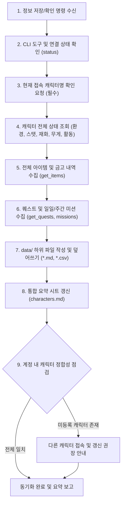
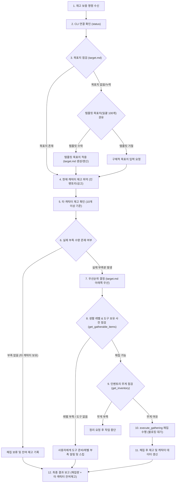

# 마비노기 모바일 헬퍼 표준 작업 흐름 (Workflows)

* **갱신 일시**: 2026년 10월 5일

본 문서는 마비노기 모바일 헬퍼 시스템에서 수행하는 핵심 작업 흐름을 규정합니다.  
주요 워크플로우는 **1. 정보 저장 및 확인 (전체 상태 동기화)**과 **2. 재고 보충 (채집)** 두 가지로 명확히 분리하여 운영합니다.

> [!IMPORTANT]
> **사용자 정의 특수 규칙(`data/workflows_custom.md`) 최우선 적용 원칙**:
> `data/workflows_custom.md` 파일이 존재하는 경우, 본 워크플로우에 정의된 기본 동작보다 해당 파일에 명시된 사용자 정의 특수 규칙이 최우선으로 적용되어 기존 절차를 무시하거나 변경하여 동작할 수 있습니다.

---

## 1. 정보 저장 및 확인 작업 흐름 (Information Sync & State Inspection Workflow)

사용자가 `"현재 캐릭터 정보 저장해줘"`, `"정보 동기화해줘"`, `"상태 확인해줘"`, `"인벤토리 갱신해줘"`, `"퀘스트/미션 기록해줘"` 등의 명령을 내렸을 때 수행하며, **현재 접속 중인 캐릭터의 모든 인게임 상태를 조회하여 로컬 데이터로 최신화**합니다.

### 1.1. 세부 실행 절차
1. **CLI 경로 및 연결 상태 점검**:
   * `data/path.txt` 확인 후 없으면 로컬 탐색하여 기록합니다.
   * `MabinogiMobile_CLI status`를 실행하여 `{"pipe":"connected"}` 상태인지 확인합니다.
2. **접속 캐릭터명 확인 (필수)**:
   * **(중요)** 커넥터 API는 현재 접속 중인 캐릭터의 닉네임을 반환하지 않으므로, 항상 **사용자에게 현재 접속 중인 캐릭터명이 무엇인지 확인 요청**합니다.
3. **캐릭터 전체 상태 및 환경 정보 조회**:
   * `get_current_environment`: 현재 위치, 날씨, 인게임 시간 확인
   * `get_my_info`: 캐릭터 기본 정보, 스탯(전투력, 생활력, 매력, 데코 점수), 현재 체력(HP) 확인
   * `get_currencies`: 보유 중인 주요 재화(골드 등) 잔액 확인
   * `get_inventory`: 인벤토리의 현재 무게 및 최대 무게 확인
   * `get_activity`: 현재 활동 상태(이동, 전투, 자동 진행 등) 확인
   * 위 정보를 종합하여 `data/(서버명)_(캐릭터명).md` 문서를 생성하거나 최신 정보로 덮어씁니다.
4. **인벤토리 및 보관함(금고) 전체 아이템 수집**:
   * `get_items`를 호출하여 가방, 캐릭터 전용 금고, 서버 공용 금고 목록을 전수 파악합니다.
   * `data/(서버명)_(캐릭터명)_inventory.csv`: 캐릭터 인벤토리 아이템 목록 갱신
   * `data/(서버명)_(캐릭터명)_bank.csv`: 캐릭터 개인 금고 아이템 목록 갱신
   * `data/(서버명)_bank_all.csv`: 동일 서버 공용 금고 아이템 목록 갱신
   * `data/(서버명)_(캐릭터명).md` 내 "데이터 업데이트 일시" 섹션에 각 CSV의 갱신 시각을 기록합니다.
5. **퀘스트 및 미션 진행 상황 수집**:
   * `get_quests`, `get_daily_missions`, `get_weekly_missions`를 호출합니다.
   * `data/(서버명)_(캐릭터명)_quest.md` 파일에 진행 중인 퀘스트 목록과 일일/주간 미션 달성 및 보상 수령 상태를 기록합니다.
6. **계정 통합 요약 시트 갱신**:
   * `data/characters.md` 문서를 열고, 이번에 수집한 캐릭터의 요약 행(서버, 직업, 레벨, 전투력, 생활력, 최종 갱신 일시)을 갱신하거나 추가합니다.
7. **계정 캐릭터 정합성 점검 및 완료 보고**:
   * 서버/계정 내 실제 보유 캐릭터 수(`MAX_CHARACTERS_PER_SERVER`=6개 기준)와 수집된 캐릭터 문서 수를 비교합니다.
   * 아직 수집되지 않은 캐릭터가 있을 경우 사용자에게 해당 캐릭터로 접속하여 갱신할 것을 권장 안내하며, 현재 캐릭터의 상태 요약을 사용자에게 보고합니다.

---

## 2. 재고 보충 작업 흐름 (Stock Replenishment & Gathering Workflow)

사용자가 `"재고 보충해줘"`, `"재료 채워줘"`, `"부족한거 채집해줘"`, `"나무 진액 목표치까지 모아줘"` 등의 명령을 내렸을 때 수행합니다. 세부 설정값 및 규칙은 [`references/constants.md`](./constants.md)를 준수합니다.

### 2.1. 세부 실행 절차
0. **관리 대상 한정**:
   * 재고 관리 대상은 채집(Gathering)을 통해 획득할 수 있는 아이템으로 한정합니다.
1. **작업 시작 및 연결 확인**:
   * `MabinogiMobile_CLI status`로 인게임 연결을 확인합니다.
2. **목표치 점검**:
   * `data/target.md`를 읽어 관리 대상 아이템의 목표 수량을 확인합니다.
   * `target.md`가 없거나 특정 아이템의 목표치가 누락된 경우:
     * 사용자에게 템플릿([`references/templates.md`](./templates.md))에 정의된 기본 목표치(`DEFAULT_TARGET_STOCK_QUANTITY`=100개)를 사용할 것을 권유합니다.
     * 사용자가 템플릿을 그대로 사용하겠다고 동의하면 템플릿의 목표치를 적용(`data/target.md` 생성 또는 갱신)합니다.
     * 사용자가 해당 목표치를 사용하지 않는다고 하면 구체적인 목표 수량을 직접 입력해 줄 것을 요구합니다.
3. **기준 캐릭터 지정 및 재고 파악**:
   * 재고 판단의 기준은 **'현재 접속한 캐릭터'**입니다.
   * 현재 캐릭터의 인벤토리(`_inventory.csv`) 및 개인 금고(`_bank.csv`), 공용 금고(`_bank_all.csv`)를 합산하여 현재 수량을 파악합니다.
4. **타 캐릭터 재고 확인**:
   * 현재 캐릭터의 재고가 목표치에 미달하는 경우, `data/`에 저장된 다른 캐릭터들의 CSV 데이터를 조회하여 해당 아이템을 보유하고 있는지 확인합니다.
5. **채집 보류 판단 (`OTHER_CHAR_STOCK_THRESHOLD`=10개 기준)**:
   * 다른 캐릭터에 재고가 **10개 이상** 존재하는 경우 해당 아이템의 채집을 보류합니다.
   * **(예외 규칙)**: 다른 캐릭터가 가진 수량이 **10개 미만**인 경우는 실질적인 재고로 보지 않고 무시하여 채집 대상에 포함합니다.
6. **우선순위 배정 (`TARGET_PRIORITY_RULE`)**:
   * `data/target.md` 목록에서 **아래쪽에 위치한 항목일수록 높은 우선순위**를 가집니다.
   * 여러 아이템이 부족할 경우, 목록의 아래쪽 아이템부터 순서대로 채집 계획을 수립합니다.
7. **채집 도구 및 생활 스킬 레벨 사전 점검 (`get_gatherable_items`)**:
   * 채집 대상 아이템에 대해 `get_gatherable_items`를 호출하여, 현재 캐릭터의 생활 스킬 레벨이 충족되는지 및 필요한 채집 도구를 보유/장착하고 있는지 사전에 점검합니다.
   * 레벨이 부족하거나 도구가 없는 경우, 사용자에게 해당 사실을 알리고 다음 우선순위 아이템으로 넘어가거나 작업을 보류합니다.
8. **무게 관리**:
   * 채집 시작 전 `get_inventory`로 인벤토리 잔여 무게를 확인합니다.
   * 무게가 부족하여 채집물을 담을 수 없다면 작업을 즉시 멈추고 사용자에게 인벤토리 정리를 요청합니다.
9. **채집 수행 (`execute_gathering`)**:
   * 부족한 수량만큼 채집을 실행합니다.
   * *(한글 인자 전달 시 UTF-8 Base64 규칙 필수 준수)*
   * 채집이 끝날 때까지 프로세스를 대기(Blocking)합니다.
10. **결과 보고 및 데이터 최신화**:
    * 채집이 완료되면 새로 획득한 수량과 다른 캐릭터에 보관된 잔여 재고 현황을 사용자에게 명확히 보고합니다.
    * 채집 후 변동된 인벤토리 정보를 `_inventory.csv` 및 `(서버)_(캐릭터).md`에 즉시 반영하여 최신 상태를 유지합니다.
