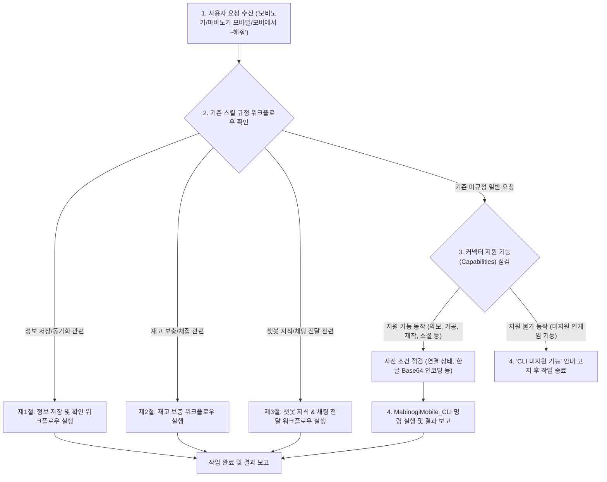
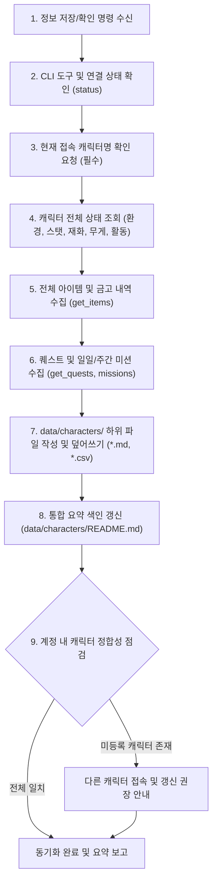
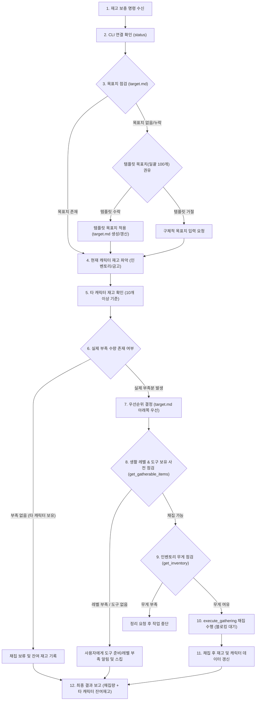
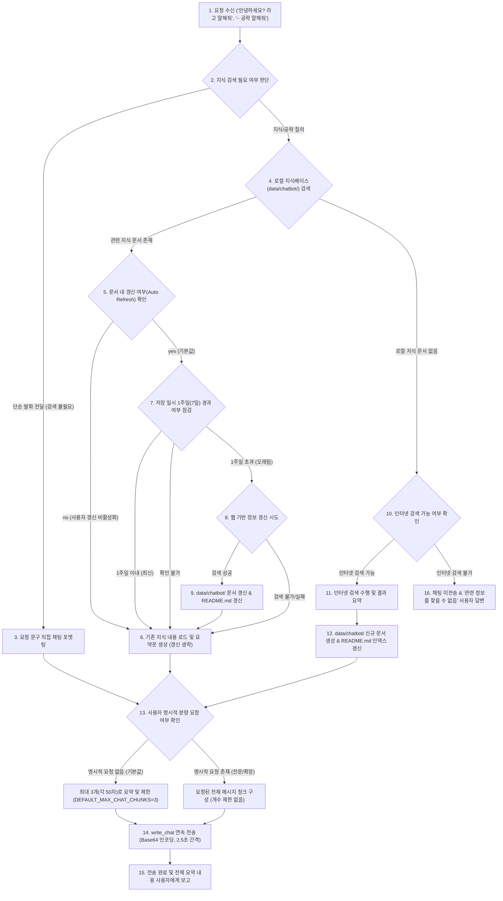

# 마비노기 모바일 헬퍼 표준 작업 흐름 (Workflows)

* **갱신 일시**: 2026년 10월 5일

본 문서는 마비노기 모바일 헬퍼 시스템에서 수행하는 전체 작업 라우팅 및 표준 작업 흐름을 규정합니다.  
사용자의 모든 인게임 요청(`"모비노기에서 ~해줘"`, `"마비노기 모바일에서 ~해줘"`, `"모비에서 ~해줘"` 등)은 **0. 일반 요청 처리 및 워크플로우 라우팅**을 거쳐 기존 규정된 3대 핵심 워크플로우(**1. 정보 저장 및 확인**, **2. 재고 보충**, **3. 챗봇 지식 조회 및 인게임 채팅 전달**)로 분기하거나, 커넥터 지원 기능(Capabilities) 검증을 거쳐 안전하게 실행됩니다.

> [!IMPORTANT]
> **사용자 정의 특수 규칙(`data/workflows_custom.md`) 적용 원칙**:
> `data/workflows_custom.md` 파일이 존재하는 경우, API 응답 다음으로 우선 적용(2순위)되며 본 워크플로우에 정의된 기본 동작보다 우선하여 기존 절차를 무시하거나 변경하여 동작할 수 있습니다.

---

## 0. 일반 요청 처리 및 워크플로우 라우팅 (General Request Routing & Capability Workflow)

사용자가 `"모비노기에서 ~해줘"`, `"마비노기 모바일에서 ~해줘"`, `"모비에서 ~해줘"` 등 일반적인 형태로 인게임 관련 작업을 요청했을 때 전체 처리 및 분기 흐름을 규정합니다.

### 0.1. 세부 실행 4단계 절차

1. **1단계: 사용자 요청 수신**
   * 사용자가 `"모비노기에서 ~해줘"`, `"마비노기 모바일에서 ~해줘"`, `"모비에서 ~해줘"` 등의 형태로 인게임 관련 요구사항을 전달합니다.
2. **2단계: 기존 스킬 규정 워크플로우 매칭 확인**
   * 요청 내용이 기존 스킬에 명확히 규정된 3대 표준 워크플로우에 해당하는지 우선 검사합니다:
     * **캐릭터 정보 저장 및 동기화**: [제1절 워크플로우](#1-정보-저장-및-확인-작업-흐름-information-sync--state-inspection-workflow)로 분기
     * **재고 보충 및 채집**: [제2절 워크플로우](#2-재고-보충-작업-흐름-stock-replenishment--gathering-workflow)로 분기
     * **챗봇 지식 조회 및 인게임 채팅 전달**: [제3절 워크플로우](#3-챗봇-지식-조회-및-인게임-채팅-전달-작업-흐름-chatbot-knowledge--chat-delivery-workflow)로 분기
   * 매칭되는 워크플로우가 존재하면 해당 전용 워크플로우 절차에 따라 즉시 실행합니다.
3. **3단계: 미규정 일반 요청 시 커넥터 기능(Capabilities) 점검**
   * 기존 3대 표준 워크플로우에 정의되지 않은 요청인 경우, [`references/cli_guide.md`](./cli_guide.md)의 **제4절 지원되는 제어 명령어 목록(Capabilities)**을 확인하여 실행 가능한 동작인지 판단합니다:
     * *조회 계열*: `get_near_npcs`, `get_near_pcs`, `get_music_scores`, `get_instruments`, `get_alterable_items`, `get_craftable_items` 등
     * *실행 계열*: `play_music_score`(악보 연주), `change_instrument`(악기 교체), `execute_altering`(가공 대기열 등록), `complete_altering_work`(가공품 수령), `execute_crafting`(아이템 제작), `get_social_actions`(소셜 행동/표정), `stop_action`(현재 액션 중지), `stand_up`(일어나기) 등
4. **4단계: 실행 또는 불가능 사유 고지 후 종료**
   * **실행 가능한 동작인 경우**:
     * CLI 도구 연결 상태(`status`), 한글/비-ASCII 데이터의 UTF-8 Base64 인코딩(`base64:`), 필요 시 인벤토리 무게 및 사전 필요 도구/조건을 점검한 후 CLI 명령어를 실행합니다.
     * 실행 결과를 사용자에게 명확히 보고하고 작업을 성공적으로 완료합니다.
   * **실행 불가능한 동작인 경우**:
     * AI 커넥터 CLI 도구에서 지원하지 않는 기능(예: 거래소 직접 매매, 경매장 입찰, 던전 직접 플레이/PvP 컨트롤, 미제공 UI 버튼 조작 등)임을 사용자에게 명확히 고지하고 작업을 안전하게 종료합니다.

### 0.2. 충돌 방지 및 우선순위 원칙
* **기존 워크플로우 우선 원칙**: 동기화, 재고 보충, 챗봇/채팅과 같이 구체적으로 정해진 표준 절차가 존재하는 작업은 반드시 해당 전용 워크플로우의 세부 규칙(정합성 관리, 우선순위, 쿨다운, 1주일 갱신 주기 등)을 완벽히 준수하며 동작합니다.
* **일반 요청의 안전성 확보**: 규정되지 않은 임의의 요청에 대해서도 사전에 Capabilities를 검증함으로써, 지원되지 않는 무리한 명령 실행을 방지하고 예측 가능한 형태로 안전하게 처리합니다.

---

## 1. 정보 저장 및 확인 작업 흐름 (Information Sync & State Inspection Workflow)

사용자가 `"현재 캐릭터 정보 저장해줘"`, `"정보 동기화해줘"`, `"상태 확인해줘"`, `"인벤토리 갱신해줘"`, `"퀘스트/미션 기록해줘"` 등의 명령을 내렸을 때 수행하며, **현재 접속 중인 캐릭터의 모든 인게임 상태를 조회하여 로컬 데이터로 최신화**합니다.

### 1.1. 세부 실행 절차
1. **CLI 경로 및 연결 상태 점검**:
   * `data/environments.json`의 `paths.cli` 확인 후 없으면 로컬 탐색하여 기록합니다.
   * `MabinogiMobile_CLI status`를 실행하여 `{"pipe":"connected"}` 상태인지 확인합니다.
2. **접속 캐릭터명 확인 (필수)**:
   * **(중요)** 커넥터 API는 현재 접속 중인 캐릭터의 닉네임을 반환하지 않으므로, 항상 **사용자에게 현재 접속 중인 캐릭터명이 무엇인지 확인 요청**합니다.
3. **캐릭터 전체 상태 및 환경 정보 조회**:
   * `get_current_environment`: 현재 위치, 날씨, 인게임 시간 확인
   * `get_my_info`: 캐릭터 기본 정보, 스탯(전투력, 생활력, 매력, 데코 점수), 현재 체력(HP) 확인
   * `get_currencies`: 보유 중인 주요 재화(골드 등) 잔액 확인
   * `get_inventory`: 인벤토리의 현재 무게 및 최대 무게 확인
   * `get_activity`: 현재 활동 상태(이동, 전투, 자동 진행 등) 확인
   * 위 정보를 종합하여 `data/characters/(서버명)_(캐릭터명).md` 문서를 생성하거나 최신 정보로 덮어씁니다.
4. **인벤토리 및 보관함(금고) 전체 아이템 수집**:
   * `get_items`를 호출하여 가방, 캐릭터 전용 금고, 서버 공용 금고 목록을 전수 파악합니다.
   * `data/characters/(서버명)_(캐릭터명)_inventory.csv`: 캐릭터 인벤토리 아이템 목록 갱신
   * `data/characters/(서버명)_(캐릭터명)_bank.csv`: 캐릭터 개인 금고 아이템 목록 갱신
   * `data/characters/(서버명)_bank_all.csv`: 동일 서버 공용 금고 아이템 목록 갱신
   * `data/characters/(서버명)_(캐릭터명).md` 내 "데이터 업데이트 일시" 섹션에 각 CSV의 갱신 시각을 기록합니다.
5. **퀘스트 및 미션 진행 상황 수집**:
   * `get_quests`, `get_daily_missions`, `get_weekly_missions`를 호출합니다.
   * `data/characters/(서버명)_(캐릭터명)_quest.md` 파일에 진행 중인 퀘스트 목록과 일일/주간 미션 달성 및 보상 수령 상태를 기록합니다.
6. **계정 통합 요약 색인 갱신**:
   * `data/characters/README.md` 문서를 열고, 이번에 수집한 캐릭터의 요약 행(서버, 직업, 레벨, 전투력, 생활력, 최종 갱신 일시)을 갱신하거나 추가합니다.

7. **계정 캐릭터 정합성 점검 및 완료 보고**:
   * 서버/계정 내 실제 보유 캐릭터 수(`MAX_CHARACTERS_PER_SERVER`=6개 기준)와 수집된 캐릭터 문서 수를 비교합니다.
   * 아직 수집되지 않은 캐릭터가 있을 경우 사용자에게 해당 캐릭터로 접속하여 갱신할 것을 권장 안내하며, 현재 캐릭터의 상태 요약을 사용자에게 보고합니다.

---

## 2. 재고 보충 작업 흐름 (Stock Replenishment & Gathering Workflow)

사용자가 `"재고 보충해줘"`, `"재료 채워줘"`, `"부족한거 채집해줘"`, `"나무 진액 목표치까지 모아줘"` 등의 명령을 내렸을 때 수행합니다. 세부 설정값 및 규칙은 [`references/constants.md`](./constants.md)를 준수합니다.

### 2.1. 세부 실행 절차
0. **관리 대상 한정**:
   * 재고 관리 대상은 채집(Gathering)을 통해 획득할 수 있는 아이템으로 한정합니다.
1. **작업 시작 및 연결 확인**:
   * `MabinogiMobile_CLI status`로 인게임 연결을 확인합니다.
2. **목표치 점검**:
   * `data/target.md`를 읽어 관리 대상 아이템의 목표 수량을 확인합니다.
   * `target.md`가 없거나 특정 아이템의 목표치가 누락된 경우:
     * 사용자에게 템플릿([`references/templates.md`](./templates.md))에 정의된 기본 목표치(`DEFAULT_TARGET_STOCK_QUANTITY`=100개)를 사용할 것을 권유합니다.
     * 사용자가 템플릿을 그대로 사용하겠다고 동의하면 템플릿의 목표치를 적용(`data/target.md` 생성 또는 갱신)합니다.
     * 사용자가 해당 목표치를 사용하지 않는다고 하면 구체적인 목표 수량을 직접 입력해 줄 것을 요구합니다.
3. **기준 캐릭터 지정 및 재고 파악**:
   * 재고 판단의 기준은 **'현재 접속한 캐릭터'**입니다.
   * 현재 캐릭터의 인벤토리(`_inventory.csv`) 및 개인 금고(`_bank.csv`), 공용 금고(`_bank_all.csv`)를 합산하여 현재 수량을 파악합니다.
4. **타 캐릭터 재고 확인**:
   * 현재 캐릭터의 재고가 목표치에 미달하는 경우, `data/characters/`에 저장된 다른 캐릭터들의 CSV 데이터를 조회하여 해당 아이템을 보유하고 있는지 확인합니다.
5. **채집 보류 판단 (`OTHER_CHAR_STOCK_THRESHOLD`=10개 기준)**:
   * 다른 캐릭터에 재고가 **10개 이상** 존재하는 경우 해당 아이템의 채집을 보류합니다.
   * **(예외 규칙)**: 다른 캐릭터가 가진 수량이 **10개 미만**인 경우는 실질적인 재고로 보지 않고 무시하여 채집 대상에 포함합니다.
6. **우선순위 배정 (`TARGET_PRIORITY_RULE`)**:
   * `data/target.md` 목록에서 **아래쪽에 위치한 항목일수록 높은 우선순위**를 가집니다.
   * 여러 아이템이 부족할 경우, 목록의 아래쪽 아이템부터 순서대로 채집 계획을 수립합니다.
7. **채집 도구 및 생활 스킬 레벨 사전 점검 (`get_gatherable_items`)**:
   * 채집 대상 아이템에 대해 `get_gatherable_items`를 호출하여, 현재 캐릭터의 생활 스킬 레벨이 충족되는지 및 필요한 채집 도구를 보유/장착하고 있는지 사전에 점검합니다.
   * 레벨이 부족하거나 도구가 없는 경우, 사용자에게 해당 사실을 알리고 다음 우선순위 아이템으로 넘어가거나 작업을 보류합니다.
8. **무게 관리**:
   * 채집 시작 전 `get_inventory`로 인벤토리 잔여 무게를 확인합니다.
   * 무게가 부족하여 채집물을 담을 수 없다면 작업을 즉시 멈추고 사용자에게 인벤토리 정리를 요청합니다.
9. **채집 수행 (`execute_gathering`)**:
   * 부족한 수량만큼 채집을 실행합니다.
   * *(한글 인자 전달 시 UTF-8 Base64 규칙 필수 준수)*
   * 채집이 끝날 때까지 프로세스를 대기(Blocking)합니다.
10. **결과 보고 및 데이터 최신화**:
    * 채집이 완료되면 새로 획득한 수량과 다른 캐릭터에 보관된 잔여 재고 현황을 사용자에게 명확히 보고합니다.
    * 채집 후 변동된 인벤토리 정보를 `data/characters/(서버)_(캐릭터)_inventory.csv` 및 `data/characters/(서버)_(캐릭터).md`에 즉시 반영하여 최신 상태를 유지합니다.

---

## 3. 챗봇 지식 조회 및 인게임 채팅 전달 작업 흐름 (Chatbot Knowledge & Chat Delivery Workflow)

사용자가 `"안녕하세요? 라고 말해줘"`, `"어비스 지옥 공략을 말해줘"`, `"양털을 채집하는 방법을 말해줘"` 등의 형태로 단순 발화 전달이나 게임 지식/공략을 요청했을 때 수행합니다.

### 3.1. 세부 실행 절차

1. **요청 분석 및 유형 구분**:
   * **단순 발화 전달 요청** (예: `"안녕하세요? 라고 말해줘"`, `"수고하셨습니다 라고 해줘"` 등):
     * 지식 검색이나 인터넷 조사를 거치지 않고, 사용자가 지정한 텍스트를 즉시 인게임 채팅 전송 단계로 전달합니다.
   * **지식/공략 검색 요청** (예: `"어비스 지옥 공략을 말해줘"`, `"양털 채집 방법 알려줘"` 등):
     * 로컬 지식베이스 검색 및 인터넷 조사를 진행합니다.
2. **로컬 지식베이스 검색 (`data/chatbot/`)**:
   * `data/chatbot/README.md`의 인덱스 테이블 및 `data/chatbot/` 내의 개별 마크다운 문서들을 검색합니다.
   * 각 문서의 `#태그` 및 제목, 본문 키워드를 매칭하여 관련 정보가 저장되어 있는지 확인합니다.
3. **로컬 정보 존재 시 처리 (1주일 갱신 주기 및 갱신 옵션 판정)**:
   * **사용자 갱신 여부(Auto Refresh) 확인**:
     * 사용자는 각 지식 문서 상단(`* **갱신 여부 (Auto Refresh)**: yes / no`) 또는 설정에서 갱신 여부를 지정할 수 있습니다.
     * **기본값은 `yes`**이며, 사용자가 명시적으로 이를 `no`로 변경한 경우 정보가 오래되었더라도 웹 조사를 수행하지 않고 **기존 데이터베이스 내용을 토대로 답변**합니다.
   * **1주일(7일) 경과 여부 점검 (`KNOWLEDGE_REFRESH_DAYS`=7)**:
     * 갱신 여부가 `yes`인 경우, 문서의 `최종 갱신 일시`를 확인합니다.
     * **1주일 이내**인 경우: 기존 문서의 내용을 그대로 신뢰하여 답변을 구성합니다.
     * **1주일(7일)을 초과**한 경우: 웹 검색을 수행하여 최신 정보로 문서를 갱신하고 `최종 갱신 일시`를 업데이트한 후 답변합니다.
     * **갱신 일시를 확인할 수 없거나 웹 조사가 불가/실패한 경우**: 기존 데이터베이스 내용을 그대로 유지하고, 기존 내용을 바탕으로 답변을 진행합니다.
4. **로컬 정보 부재 시 - 인터넷 검색 (`search_web`)**:
   * 환경에서 인터넷 검색이 지원되는 경우, 질문에 대한 웹 검색을 수행하여 신뢰성 있는 최신 공략/정보를 수집합니다.
   * 수집된 정보를 바탕으로 명확하고 읽기 쉬운 공략 문서를 작성하여 `data/chatbot/(주제명).md` 파일로 저장합니다.
   * 저장 시 상단에 `#태그` 및 `갱신 여부 (Auto Refresh): yes`를 필수로 명시하고, `data/chatbot/README.md`의 색인 목록에 새 문서를 등록합니다.
   * 수집/요약된 정보를 바탕으로 인게임 채팅용 전달 메시지를 구성합니다.
5. **로컬 정보 부재 시 - 인터넷 검색 불가 환경**:
   * 인터넷 검색 도구가 없거나 비활성화된 경우, **인게임 채팅(`write_chat`)을 절대 전송하지 않습니다.**
   * 사용자에게 *"관련 정보를 찾을 수 없었습니다."*라고 명확히 답변하고 안내를 종료합니다.
6. **메시지 분할 및 청크 개수 제어 (`MAX_CHAT_LENGTH`, `DEFAULT_MAX_CHAT_CHUNKS`)**:
   * **접두사(머리말) 생략 및 핵심 정보 전달 원칙**:
     * 채팅 입력 시 `[공략 1/5]`, `[주제명]`, `(1/3)` 등의 **불필요한 주제, 머리말, 개수/순번 표기 접두사를 일체 붙이지 않습니다.**
     * 50자 제한 공간을 최대한 활용하여 오직 **핵심 내용과 공략 정보 본문만**을 깔끔하게 전달합니다.
   * **기본 동작 (명시적 요청이 없는 경우)**:
     * 1회 전달하는 채팅 메시지는 **최대 3개(`DEFAULT_MAX_CHAT_CHUNKS`=3)**로 제한합니다.
     * 정보를 가급적 3개 메시지(각 50자 이내) 이내로 핵심만 간결하게 요약하여 전달합니다.
   * **사용자의 명시적 요청이 있는 경우**:
     * 사용자가 `"전부 다 말해줘"`, `"모든 내용 채팅으로 쳐줘"`, `"자세하게 다 입력해줘"` 등 전체 내용 전달을 요구한 경우, 3개 개수 제한을 해제하고 요청한 모든 메시지를 전달합니다.
7. **인게임 채팅 전송 (`write_chat`)**:
   * 인게임 채팅 제약 조건을 철저히 준수합니다:
     * **최대 글자 수 (`MAX_CHAT_LENGTH`=50자)**: 1회 메시지가 50자를 넘지 않도록 문맥을 고려하여 자연스럽게 분할합니다.
     * **한글 인코딩**: 한글 문자열은 반드시 UTF-8 Base64로 인코딩하여 `base64:<인코딩문자열>` 형태로 전달합니다.
     * **전송 쿨다운 (`CHAT_RATE_LIMIT_SECONDS`=2.5초)**: 연속 메시지 전송 시 각 메시지 사이에 최소 2.5초의 대기 시간을 둡니다.
   * 전송이 완료되면 사용자에게 인게임 채팅 전송이 완료되었음을 알리고 전체 내용을 요약 보고합니다.

