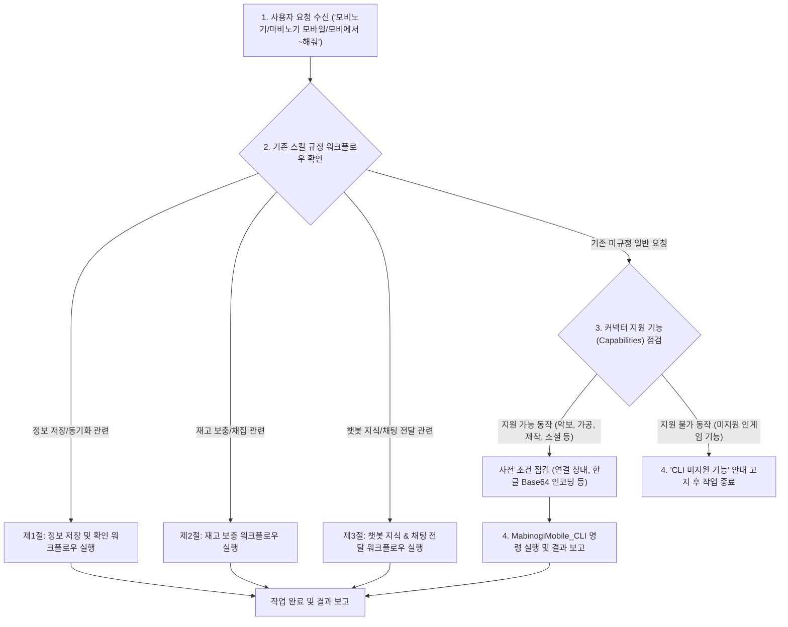

# 마비노기 모바일 헬퍼 표준 작업 흐름 (Workflows)

* **갱신 일시**: 2026년 10월 5일

본 디렉토리는 마비노기 모바일 헬퍼 시스템에서 수행하는 전체 작업 라우팅 및 표준 작업 흐름을 규정합니다.  
사용자의 모든 인게임 요청(`"모비노기에서 ~해줘"`, `"마비노기 모바일에서 ~해줘"`, `"모비에서 ~해줘"` 등)은 **0. 일반 요청 처리 및 워크플로우 라우팅**을 거쳐 기존 규정된 3대 핵심 워크플로우(**1. 정보 저장 및 확인**, **2. 재고 보충**, **3. 챗봇 지식 조회 및 인게임 채팅 전달**)로 분기하거나, 커넥터 지원 기능(Capabilities) 검증을 거쳐 안전하게 실행됩니다.

> [!IMPORTANT]
> **사용자 정의 특수 규칙(`data/workflows_custom.md`) 적용 원칙**:
> `data/workflows_custom.md` 파일이 존재하는 경우, API 응답 다음으로 우선 적용(2순위)되며 본 워크플로우에 정의된 기본 동작보다 우선하여 기존 절차를 무시하거나 변경하여 동작할 수 있습니다.

---

## 전체 워크플로우 라우팅 맵

---

## 세부 워크플로우 색인

| 절 | 작업 흐름명 | 문서 링크 | 핵심 요약 |
| :---: | :--- | :--- | :--- |
| **제0절** | **일반 요청 라우팅 및 기능 점검** | [`routing.md`](./routing.md) | 사용자 요청 수신, 3대 워크플로우 매칭 및 커넥터 Capabilities 점검/실행 절차 |
| **제1절** | **정보 저장 및 확인** | [`info_sync.md`](./info_sync.md) | 캐릭터 기본 정보, 스탯, 인벤토리/금고 CSV, 퀘스트/미션 저장 및 요약 색인 갱신 |
| **제2절** | **재고 보충 및 채집** | [`stock_replenishment.md`](./stock_replenishment.md) | 목표치 점검, 타 캐릭터 재고(10개 기준) 확인, 우선순위 정렬, 사전 점검 및 채집 |
| **제3절** | **챗봇 지식 조회 & 채팅 전달** | [`chatbot_chat.md`](./chatbot_chat.md) | 단순 발화/지식 질의 구분, 1주일 갱신 주기 관리, 50자 분할 및 최대 3개 청크 전송 |
