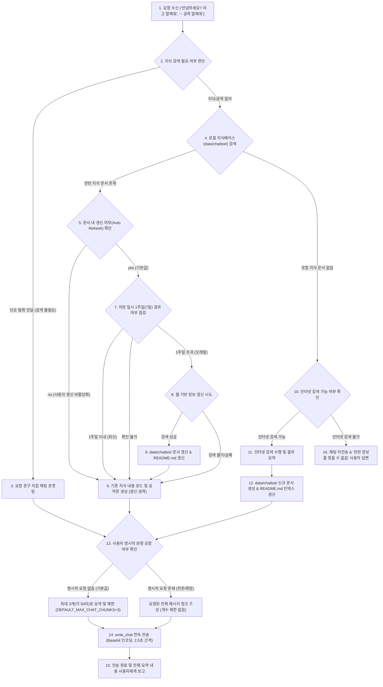

# 제3절: 챗봇 지식 조회 및 인게임 채팅 전달 작업 흐름 (Chatbot Knowledge & Chat Delivery Workflow)

* **갱신 일시**: 2026년 10월 5일

사용자가 `"안녕하세요? 라고 말해줘"`, `"어비스 지옥 공략을 말해줘"`, `"양털을 채집하는 방법을 말해줘"` 등의 형태로 단순 발화 전달이나 게임 지식/공략을 요청했을 때 수행합니다.

---

## 1. 워크플로우 다이어그램

---

## 2. 세부 실행 절차

1. **요청 분석 및 유형 구분**:
   * **단순 발화 전달 요청** (예: `"안녕하세요? 라고 말해줘"`, `"수고하셨습니다 라고 해줘"` 등):
     * 지식 검색이나 인터넷 조사를 거치지 않고, 사용자가 지정한 텍스트를 즉시 인게임 채팅 전송 단계로 전달합니다.
   * **지식/공략 검색 요청** (예: `"어비스 지옥 공략을 말해줘"`, `"양털 채집 방법 알려줘"` 등):
     * 로컬 지식베이스 검색 및 인터넷 조사를 진행합니다.
2. **로컬 지식베이스 검색 (`data/chatbot/`)**:
   * `data/chatbot/README.md`의 인덱스 테이블 및 `data/chatbot/` 내의 개별 마크다운 문서들을 검색합니다.
   * 각 문서의 `#태그` 및 제목, 본문 키워드를 매칭하여 관련 정보가 저장되어 있는지 확인합니다.
3. **로컬 정보 존재 시 처리 (1주일 갱신 주기 및 갱신 옵션 판정)**:
   * **사용자 갱신 여부(Auto Refresh) 확인**:
     * 사용자는 각 지식 문서 상단(`* **갱신 여부 (Auto Refresh)**: yes / no`) 또는 설정에서 갱신 여부를 지정할 수 있습니다.
     * **기본값은 `yes`**이며, 사용자가 명시적으로 이를 `no`로 변경한 경우 정보가 오래되었더라도 웹 조사를 수행하지 않고 **기존 데이터베이스 내용을 토대로 답변**합니다.
   * **1주일(7일) 경과 여부 점검 (`KNOWLEDGE_REFRESH_DAYS`=7)**:
     * 갱신 여부가 `yes`인 경우, 문서의 `최종 갱신 일시`를 확인합니다.
     * **1주일 이내**인 경우: 기존 문서의 내용을 그대로 신뢰하여 답변을 구성합니다.
     * **1주일(7일)을 초과**한 경우: 웹 검색을 수행하여 최신 정보로 문서를 갱신하고 `최종 갱신 일시`를 업데이트한 후 답변합니다.
     * **갱신 일시를 확인할 수 없거나 웹 조사가 불가/실패한 경우**: 기존 데이터베이스 내용을 그대로 유지하고, 기존 내용을 바탕으로 답변을 진행합니다.
4. **로컬 정보 부재 시 - 인터넷 검색 (`search_web`)**:
   * 환경에서 인터넷 검색이 지원되는 경우, 질문에 대한 웹 검색을 수행하여 신뢰성 있는 최신 공략/정보를 수집합니다.
   * 수집된 정보를 바탕으로 명확하고 읽기 쉬운 공략 문서를 작성하여 `data/chatbot/(주제명).md` 파일로 저장합니다.
   * 저장 시 상단에 `#태그` 및 `갱신 여부 (Auto Refresh): yes`를 필수로 명시하고, `data/chatbot/README.md`의 색인 목록에 새 문서를 등록합니다.
   * 수집/요약된 정보를 바탕으로 인게임 채팅용 전달 메시지를 구성합니다.
5. **로컬 정보 부재 시 - 인터넷 검색 불가 환경**:
   * 인터넷 검색 도구가 없거나 비활성화된 경우, **인게임 채팅(`write_chat`)을 절대 전송하지 않습니다.**
   * 사용자에게 *"관련 정보를 찾을 수 없었습니다."*라고 명확히 답변하고 안내를 종료합니다.
6. **메시지 분할 및 청크 개수 제어 (`MAX_CHAT_LENGTH`, `DEFAULT_MAX_CHAT_CHUNKS`)**:
   * **접두사(머리말) 생략 및 핵심 정보 전달 원칙**:
     * 채팅 입력 시 `[공략 1/5]`, `[주제명]`, `(1/3)` 등의 **불필요한 주제, 머리말, 개수/순번 표기 접두사를 일체 붙이지 않습니다.**
     * 50자 제한 공간을 최대한 활용하여 오직 **핵심 내용과 공략 정보 본문만**을 깔끔하게 전달합니다.
   * **기본 동작 (명시적 요청이 없는 경우)**:
     * 1회 전달하는 채팅 메시지는 **최대 3개(`DEFAULT_MAX_CHAT_CHUNKS`=3)**로 제한합니다.
     * 정보를 가급적 3개 메시지(각 50자 이내) 이내로 핵심만 간결하게 요약하여 전달합니다.
   * **사용자의 명시적 요청이 있는 경우**:
     * 사용자가 `"전부 다 말해줘"`, `"모든 내용 채팅으로 쳐줘"`, `"자세하게 다 입력해줘"` 등 전체 내용 전달을 요구한 경우, 3개 개수 제한을 해제하고 요청한 모든 메시지를 전달합니다.
7. **인게임 채팅 전송 (`write_chat`)**:
   * 인게임 채팅 제약 조건을 철저히 준수합니다:
     * **최대 글자 수 (`MAX_CHAT_LENGTH`=50자)**: 1회 메시지가 50자를 넘지 않도록 문맥을 고려하여 자연스럽게 분할합니다.
     * **한글 인코딩**: 한글 문자열은 반드시 UTF-8 Base64로 인코딩하여 `base64:<인코딩문자열>` 형태로 전달합니다.
     * **전송 쿨다운 (`CHAT_RATE_LIMIT_SECONDS`=2.5초)**: 연속 메시지 전송 시 각 메시지 사이에 최소 2.5초의 대기 시간을 둡니다.
   * 전송이 완료되면 사용자에게 인게임 채팅 전송이 완료되었음을 알리고 전체 내용을 요약 보고합니다.
