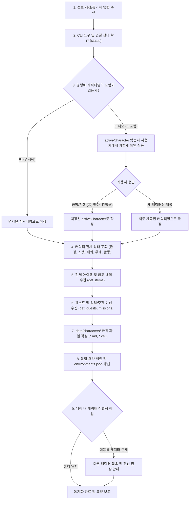

# 제1절: 정보 저장 및 확인 작업 흐름 (Information Sync & State Inspection Workflow)

* **갱신 일시**: 2026년 10월 5일

사용자가 `"현재 캐릭터 정보 저장해줘"`, `"정보 동기화해줘"`, `"상태 확인해줘"`, `"인벤토리 갱신해줘"`, `"퀘스트/미션 기록해줘"` 등의 명령을 내렸을 때 수행하며, **현재 접속 중인 캐릭터의 모든 인게임 상태를 조회하여 로컬 데이터로 최신화**합니다.

---

## 1. 워크플로우 다이어그램

---

## 2. 세부 실행 절차

0. **파이썬 스크립트 즉시 실행 및 로직 동기화 원칙**:
   * Python 가상환경(`.venv`)이 갖추어져 있는 경우, 캐릭터명이 확인되면 단계별 수동 CLI 호출 대신 표준 스크립트([`scripts/sync_character.py`](../../scripts/README.md#1-synccharacterpy-캐릭터-전체-상태-및-데이터-동기화))를 바로 실행합니다 (`.venv\Scripts\python.exe scripts/sync_character.py --char-name <캐릭터명>`).
   * 워크플로우 문서의 절차와 파이썬 스크립트의 로직은 항상 완전한 sync(정합성)를 유지합니다.
1. **CLI 경로 및 연결 상태 점검**:
   * `data/environments.json`의 `paths.cli` 확인 후 없으면 로컬 탐색하여 기록합니다.
   * `MabinogiMobile_CLI status`를 실행하여 `{"pipe":"connected"}` 상태인지 확인합니다.
2. **접속 캐릭터명 식별 및 확인 절차 (필수)**:
   * **(원칙)** 커넥터 API는 현재 접속 중인 캐릭터의 닉네임을 반환하지 않습니다.
   * **분기 1: 사용자가 캐릭터명을 명시한 경우** (`"아미나 정보 갱신해줘"` 등):
     * 추가 질문 없이 사용자가 지정한 캐릭터명으로 즉시 확정하여 동기화를 진행합니다.
   * **분기 2: 사용자가 캐릭터명을 명시하지 않은 경우** (`"정보 갱신해줘"` 등):
     * `data/environments.json`의 `activeCharacter`를 읽고 사용자에게 확인 질문을 합니다:
       > *"현재 접속 중인 캐릭터가 '[activeCharacter]'가 맞으신가요? (맞으시면 그대로 진행하며, 다른 캐릭터라면 이름을 알려주세요.)"*
     * 사용자가 긍정/진행 승인(`"응"`, `"맞아"`, `"진행해"` 등)을 하면 저장된 `activeCharacter`를 그대로 따릅니다.
     * 사용자가 새로운 캐릭터명을 명시해주면 해당 캐릭터명으로 확정합니다.
   * 동기화 완료 시 `data/environments.json`의 `activeCharacter`를 확정된 캐릭터명으로 최신화합니다.
3. **캐릭터 전체 상태 및 환경 정보 조회**:
   * `get_current_environment`: 현재 위치, 날씨, 인게임 시간 확인
   * `get_my_info`: 캐릭터 기본 정보, 스탯(전투력, 생활력, 매력, 데코 점수), 현재 체력(HP) 확인
   * `get_currencies`: 보유 중인 주요 재화(골드 등) 잔액 확인
   * `get_inventory`: 인벤토리의 현재 무게 및 최대 무게 확인
   * `get_activity`: 현재 활동 상태(이동, 전투, 자동 진행 등) 확인
   * 위 정보를 종합하여 `data/characters/(서버명)_(캐릭터명).md` 문서를 생성하거나 최신 정보로 덮어씁니다.
4. **인벤토리 및 보관함(금고) 전체 아이템 수집**:
   * `get_items`를 호출하여 가방, 캐릭터 전용 금고, 서버 공용 금고 목록을 전수 파악합니다.
   * `data/characters/(서버명)_(캐릭터명)_inventory.csv`: 캐릭터 인벤토리 아이템 목록 갱신
   * `data/characters/(서버명)_(캐릭터명)_bank.csv`: 캐릭터 개인 금고 아이템 목록 갱신
   * `data/characters/(서버명)_bank_all.csv`: 동일 서버 공용 금고 아이템 목록 갱신
   * `data/characters/(서버명)_(캐릭터명).md` 내 "데이터 업데이트 일시" 섹션에 각 CSV의 갱신 시각을 기록합니다.
5. **퀘스트 및 미션 진행 상황 수집**:
   * `get_quests`, `get_daily_missions`, `get_weekly_missions`를 호출합니다.
   * `data/characters/(서버명)_(캐릭터명)_quest.md` 파일에 진행 중인 퀘스트 목록과 일일/주간 미션 달성 및 보상 수령 상태를 기록합니다.
6. **계정 통합 요약 색인 갱신**:
   * `data/characters/README.md` 문서를 열고, 이번에 수집한 캐릭터의 요약 행(서버, 직업, 레벨, 전투력, 생활력, 최종 갱신 일시)을 갱신하거나 추가합니다.
7. **계정 캐릭터 정합성 점검 및 완료 보고**:
   * 서버/계정 내 실제 보유 캐릭터 수(`MAX_CHARACTERS_PER_SERVER`=6개 기준)와 수집된 캐릭터 문서 수를 비교합니다.
   * 아직 수집되지 않은 캐릭터가 있을 경우 사용자에게 해당 캐릭터로 접속하여 갱신할 것을 권장 안내하며, 현재 캐릭터의 상태 요약을 사용자에게 보고합니다.
