# 제5절: 생활 스킬 집중 육성 작업 흐름 (1-Hour Life Skill Leveling Loop Workflow)

* **상태**: ⚠️ 시험적 기능 (Experimental)
* **갱신 일시**: 2026년 10월 5일

사용자가 `"생활 노가다 알아서 해줘"`, `"생활 스킬 레벨 올리자"`, `"생활 스킬 레벨 올려줘"` 등의 명령을 내렸을 때 수행되는 **1시간 집중 생활 스킬(채집·가공·제작) 수련 자동화 워크플로우**입니다.  
**특징**: 단순 재고 보충 목적의 단발성 채집([제2절](./stock_gathering.md))이나 가공([제3절](./stock_altering.md))과 달리, **단위 시간당 생활 수련치/경험치 획득 극대화**를 목표로 하여 **채집 ➔ 최단 시간 가공 ➔ 연계 제작**을 1시간(60분) 동안 유기적으로 순환 반복합니다.

> [!WARNING]
> **시험적 기능 고지 및 사전 승인 필수 (Experimental Feature)**:  
> 본 워크플로우는 **시험적 기능(Experimental)**입니다. 1시간 동안 채집, 가공, 제작을 복합적으로 연계 순환하는 고도 자동화 특성상, 인게임 시설 상황이나 대기열, 클라이언트 통신 상태에 따라 정상 동작하지 않을 수 있습니다. **반드시 작업 시작 전단계에서 사용자에게 시험적 기능임을 명확히 고지하고, 진행 승인(동의)을 받은 후에만 1시간 루프에 진입해야 합니다.**

---

## 1. 워크플로우 다이어그램

```mermaid
flowchart TD
    Start["1. 트리거 수신 ('생활 노가다 알아서 해줘' 등)"] --> CheckConn["2. CLI 연결 확인 (status) & 캐릭터 확인"]
    CheckConn --> WarnExp{"3. [필수] 시험적 기능 고지 & 진행 승인 요청"}
    WarnExp -- "승인 거부/보류" --> StopWork["작업 중단 및 안내"]
    WarnExp -- "진행 승인" --> AskUser["4. [사전 단계] 집중 육성 스킬군 & 현재 레벨 질의"]
    AskUser --> CheckQueue["5. [사전 단계] 가공 대기열 점검 (get_altering_works)"]
    
    CheckQueue --> CompletedExist{"완료 가공물 존재 여부"}
    CompletedExist -- "완료물 있음" --> CollectBefore["사전 수령 (complete_altering_work)"]
    CompletedExist -- "없음" --> CheckLongWorks
    CollectBefore --> CheckLongWorks{"장시간 진행 작업 존재 여부"}
    
    CheckLongWorks -- "슬롯 부족 (장시간 작업 점유)" --> RequestClearQueue["사용자에게 대기열 정리 요청 후 대기"]
    RequestClearQueue --> CheckInventory
    CheckLongWorks -- "슬롯 여유 충분" --> CheckInventory["6. [사전 단계] 인벤토리 무게 & 도구 점검"]
    
    CheckInventory --> UserConfirm{"사용자 준비 완료 확인"}
    UserConfirm -- "준비 완료 승인" --> PlanTargets["7. 최단 시간 가공물 선정 & 필요 채집 원자재 산출"]
    
    PlanTargets --> LoopStart["=== 8. 1시간(60분) 순환 루프 진입 ==="]
    
    subgraph Loop["1시간 생활 수련 순환 사이클 (3~5분 주기)"]
        direction TB
        Collect["① 가공 완료물 즉시 수령 (complete_altering_work)"] --> Alter["② 빈 슬롯에 최단 시간 가공물 등록 (execute_altering)"]
        Alter --> Craft["③ 연계 제작대 이동 및 제작 실행 (execute_crafting)"]
        Craft --> Gather["④ 잔여 대기 시간 동안 필요 원자재 자동 채집 (execute_gathering)"]
        Gather --> CheckSafety{"⑤ 안전 점검 (무게 95% 초과? 클라이언트 연결?)"}
        CheckSafety -- "무게 위험" --> HandleWeight["소모 제작 우선 또는 채집 일시 중단"]
        CheckSafety -- "정상" --> CheckTimer{"⑥ 1시간(3,600초) 경과 여부"}
        HandleWeight --> CheckTimer
    end
    
    LoopStart --> Collect
    CheckTimer -- "진행 중 (시간 잔여)" --> Collect
    CheckTimer -- "1시간 경과 또는 중단" --> Finalize["9. 안전 중지 (stop_action) & 최종 가공물 수령"]
    
    Finalize --> SyncData["10. 인벤토리/캐릭터 전체 데이터 동기화 (sync_character.py)"]
    SyncData --> Report["11. 1시간 생활 수련 최종 성과 보고"]
    Report --> End["종료"]
```



---

## 2. 세부 실행 절차

### 【1단계: 사전 인터랙션 및 환경 점검 (Pre-workflow Phase)】
> [!IMPORTANT]
> **모든 사용자 질문과 시험적 기능 고지/승인은 반드시 워크플로우 본격 시작 전단계에서 완료해야 합니다.**  
> 루프가 시작된 후에는 1시간 동안 무인 자동 순환되므로 중도 인터랙션을 최소화합니다.

1. **명령 수신 및 시험적 기능 사전 승인 (필수)**:
   * 트리거 발화(`"생활 노가다 알아서 해줘"`, `"생활 스킬 레벨 올리자"`, `"생활 스킬 레벨 올려줘"`) 수신 시 본 워크플로우를 가동합니다.
   * `MabinogiMobile_CLI status`로 통신 연결(`{"pipe":"connected"}`)을 확인합니다.
   * `data/environments.json`의 `activeCharacter`를 확인하고, 접속 중인 캐릭터가 맞는지 검증합니다.
   * **⚠️ 시험적 기능 고지 및 진행 승인**:
     * 사용자에게 다음과 같이 명확히 고지하고 동의를 구합니다:  
       > *"생활 스킬 집중 육성(1시간 루프) 기능은 현재 **시험적 기능(Experimental)**으로 제공되고 있어, 게임 내 환경이나 대기열, 이동 상황에 따라 정상 동작하지 않을 수 있습니다. 계속 진행하시겠습니까?"*
     * 사용자가 진행 승인(`"응"`, `"진행해"`, `"계속해"` 등)을 한 경우에만 다음 단계로 이동합니다.


2. **집중 육성 생활 스킬 및 현재 레벨 사전 질의**:
   * API에서 개별 생활 스킬 레벨을 직접 조회할 수 없으므로, 사용자에게 아래 사항을 질의합니다:
     * **집중 육성할 생활 분야**:
       1. 벌목 & 목공 (통나무 ➔ 목재 ➔ 목공 장비/다목적 제작)
       2. 채광 & 대장기술 (철광석 ➔ 철괴 ➔ 금속 무기/중갑 제작)
       3. 방직 & 재단/경갑 (양털/거미줄 ➔ 실/옷감 ➔ 경갑/의복 제작)
       4. 약초 채집 & 약품 가공 (허브/버섯 ➔ 진액/가루 ➔ 물약/붕대/비약 제작)
       5. 추수/채집 & 요리 (밀/콩/쌀/고기 ➔ 반죽/두부 ➔ 요리 제작)
       6. 균형 육성 (전체 고른 수련)
     * **현재 해당 생활 스킬의 레벨**: (적정 수련 티어 매핑용)

3. **가공 대기열 사전 점검 및 정리 요청**:
   * `get_altering_works`를 호출하여 현재 가공 시설 대기열을 점검합니다.
   * 이미 완료된 작업(`IsCompleted: true`)은 `complete_altering_work`를 즉시 호출하여 자동 일괄 수령합니다.
   * 남은 시간(`RemainingSeconds`)이 긴 장시간 작업(예: 10분 초과)이 다수 슬롯을 차지하여 빈 슬롯이 2개 미만인 경우:
     * **사용자에게 가공 대기열을 비워둘 것을 요청**:  
       *"가공 시설 슬롯이 장시간 작업으로 차 있어 빠른 회전 수련이 어렵습니다. 인게임에서 대기열을 비워주시거나 정리 후 알려주세요."*
     * 사용자가 대기열을 확보하고 확인("비웠어", "진행해")하면 다음으로 이동합니다.

4. **인벤토리 및 도구 준비 상태 사전 점검 요청**:
   * `get_inventory`로 무게 잔여량 점검 (권장: 여유 공간 20% 이상).
   * 채집 도구(도끼, 곡괭이, 낫, 가위 등)가 가방에 충분히 구비되어 있는지 사용자에게 확인 안내합니다.
   * 사용자의 최종 진행 승인을 받으면 본격적인 1시간 자동 루프에 진입합니다.
   * **(파이썬 스크립트 즉시 실행 & 로직 동기화 원칙)**: 사전 승인이 완료되고 Python 가상환경(`.venv`)이 갖추어져 있는 경우, 수동 반복 제어 대신 표준 스크립트([`scripts/execute_life_leveling.py`](../../scripts/README.md#6-executelifelevelingpy-1시간-생활-스킬-집중-육성-순환-루프-️-시험적-기능))를 바로 실행합니다 (`.venv\Scripts\python.exe scripts/execute_life_leveling.py --confirm --focus-skill <분야>`). 워크플로우 문서의 순환 로직과 파이썬 스크립트는 항상 1:1 정합성 및 sync를 유지합니다.

---

### 【2단계: 목표치 수립 및 최단 시간 가공물 선정 (Planning)】

1. **가공물 선정 원칙 (Shortest Duration First: 최단 시간 우선)**:
   * **원칙**: 단위 시간당 가공 경험치 및 회전율을 극대화하기 위해, **가공 소요 시간(`RemainingSeconds` 또는 생산 주기)이 가장 짧은 기초 1차 가공물**을 최우선 선정합니다.
   * **주요 분야별 최단 시간 가공물 매핑**:
     * **목공**: `목재` (기본 목재), `목재+` (회전 주기 약 1~2분)
     * **대장**: `철괴(철 광석)`, `철괴(광석)` (회전 주기 약 1~2분)
     * **방직**: `실`, `옷감`, `식물 섬유` (회전 주기 약 1~2분)
     * **약품**: `새록 버섯 진액`, `튼튼 버섯 가루`, `숨숨꽃 가루` (회전 주기 약 1~2분)
     * **요리**: `물에 불린 쌀`, `물에 불린 콩`, `마요네즈` (회전 주기 약 1~2분)

2. **필요 채집 원자재 산출 (Backward Planning)**:
   * 선정된 최단 시간 가공물 레시피에 필요한 1차 원자재 목록 도출.
   * `get_gatherable_items`를 호출하여 해당 원자재가 현재 생활 레벨로 채집 가능하고 도구(`ToolOk: true`)가 갖추어져 있는지 확인합니다.

---

### 【3단계: 1시간 생활 수련 순환 루프 (Execution Phase)】

* **총 운영 시간**: `DEFAULT_LIFE_SESSION_MINUTES` = 60분 (3,600초).
* **사이클 주기**: 약 3~5분 단위로 아래 5개 세부 스텝을 순환 실행합니다:

```
[사이클 시작]
  │
  ├─① [가공물 일괄 수령]: complete_altering_work 로 완료된 작업물 즉시 수령
  │
  ├─② [신규 가공 의뢰 등록]: get_altering_works 빈 슬롯 확인 ➔ execute_altering 최단시간 가공물 등록
  │
  ├─③ [연계 제작 실행]: get_craftable_items 확인 ➔ 수령한 가공품으로 즉시 제작 가능한 품목 제작(execute_crafting)
  │
  ├─④ [원자재 실시간 채집]: 가공 대기 시간(약 2~3분) 동안 execute_gathering 으로 부족 원자재 자동 채집
  │
  ├─⑤ [안전 및 무게 점검]: get_inventory 확인 (95% 초과 시 소모 제작 우선 또는 채집 정지)
  │
  └─⑥ [타이머 점검]: 60분 경과 시 루프 종료, 미달 시 ①로 순환
```

#### 세부 스텝 상세:
* **① 가공물 수령**: `get_altering_works`에서 완료된 건이 있으면 `complete_altering_work`를 호출하여 시설 이동 및 결과물 일괄 수령.
* **② 가공 등록**: 빈 슬롯이 있으면 선정된 최단 시간 가공물을 1회씩 등록 (`execute_altering base64:...`).
* **③ 연계 제작**: 가공물이나 원자재를 소모하여 제작 스킬을 올릴 수 있는 레시피(예: 캠프파이어 키트, 못, 붕대, 도구류 등)를 `execute_crafting`으로 1~3회 실행.
* **④ 채집 보충**: 가공 대기열이 가동되는 유휴 시간 동안 필드로 이동하여 부족한 1차 원자재를 목표 수량까지 채집 (`execute_gathering`). 목표 도달 또는 가공 완료 시점에 `stop_action` 호출.
* **⑤ 무게 및 안전 관리**: 인벤토리 무게가 95% 이상 도달 시 채집을 즉시 멈추고 제작/가공으로 재료를 소모하거나 안전 대기 모드로 전환.

---

### 【4단계: 사후 데이터 동기화 및 결과 보고 (Reporting Phase)】

1. **안전 종료**:
   * 1시간 경과 시 진행 중인 채집/행동을 `stop_action`으로 안전하게 중지합니다.
   * 시설에 완료된 마지막 가공물이 남아 있다면 `complete_altering_work`로 최종 수령합니다.

2. **데이터 동기화 (`sync_character.py`)**:
   * 변동된 인벤토리, 금고, 캐릭터 기본 스탯을 동기화하여 `data/characters/` 파일들을 최신화합니다.

3. **결과 보고서 전달**:
   * 총 진행 시간 (약 60분)
   * 1시간 동안 채집한 원자재 총 수량
   * 완료 및 수령한 가공품 총 수량
   * 제작 완료한 아이템 총 수량
   * 캐릭터의 생활력(`LivingScore`) 변동치 및 인게임 생활 레벨 성장 확인 안내.

---

## 3. 예외 상황 대응 매뉴얼 (Error Handling)

| 상황 | 원인 | 대응 절차 |
| :--- | :--- | :--- |
| **가공 슬롯 부족** | 사전 장시간 작업 미정리 | 시작 전 사용자에게 대기열 비우기 요청. 진행 중에는 잔여 빈 슬롯만 활용 |
| **채집 도구 파손/부족** | 도구 내구도 소진 | `ToolOk: false` 감지 시 해당 채집 일시 중단, 사용자에게 안내 및 대체 품목 전환 |
| **인벤토리 무게 초과** | 채집물 누적 | 무게 95% 도달 시 즉시 `stop_action`. 재료 소모 제작 실행 또는 작업 조기 안전 마감 |
| **인게임 모달 방해** | CLI `blocked` 에러 반환 | 최대 3회 재시도 후 지속 시 사용자에게 인게임 확인 요청 |
| **클라이언트 끊김** | 파이프 단절 (status != connected) | 안전 루프 탈출 후 게임 재접속 및 AI 제어 옵션 확인 안내 |
