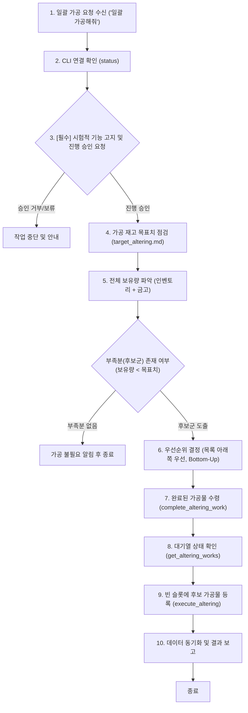

# 제3절: 일괄 가공 요청 작업 흐름 (Batch Altering Stock Replenishment Workflow)

* **상태**: ⚠️ 시험적 기능 (Experimental)
* **갱신 일시**: 2026년 10월 5일

사용자가 `"일괄 가공해줘"` 등의 명령을 내렸을 때 수행되는 **단발성 가공 자동화 워크플로우**입니다.  
**주의**: 본 워크플로우는 특정 단일 아이템만 수동 가공하는 개별 가공 요청을 수행하는 워크플로우가 아니며, `target_altering.md`의 목표치 대비 부족분을 일괄 점검하여 완료된 작업물을 수령하고 빈 대기열에 새 가공물을 1회 등록한 뒤 종료하는 워크플로우입니다.

> [!WARNING]
> **시험적 기능 고지 및 사전 승인 필수 (Experimental Feature)**:  
> 본 워크플로우는 **시험적 기능(Experimental)**입니다. 인게임 가공 시설 상태, 대기열 점유 상황, 네트워크 환경에 따라 정상 동작하지 않을 수 있습니다. **반드시 작업 시작 전단계에서 사용자에게 시험적 기능임을 고지하고, 진행 승인(동의)을 받은 후에만 후속 절차를 진행해야 합니다.**

---

## 1. 워크플로우 다이어그램

---

## 2. 세부 실행 절차

### 1단계: 명령 수신, 연결 점검 및 시험적 기능 사전 승인
* 사용자가 `"일괄 가공해줘"`, `"가공품 채워줘"`, `"가공 재고 보충해줘"` 등의 명령을 내리면 본 워크플로우를 단발성으로 트리거합니다.
* `MabinogiMobile_CLI status`로 인게임 클라이언트 연결 상태(`{"pipe":"connected"}`)를 확인합니다.
* **⚠️ 시험적 기능 사전 고지 및 승인 (필수)**:
  * 사용자에게 다음과 같이 명확히 안내하고 진행 여부를 확인합니다:  
    > *"일괄 가공 기능은 현재 **시험적 기능(Experimental)**으로 제공되고 있어, 게임 내 시설 상태나 대기열 상황에 따라 정상 동작하지 않을 수 있습니다. 계속 진행하시겠습니까?"*
  * 사용자가 긍정/승인(`"진행해"`, `"응"`, `"계속해"` 등)한 경우에만 2단계로 이동하며, 거부 시 작업을 안전하게 종료합니다.
* **(파이썬 스크립트 즉시 실행 & 로직 동기화 원칙)**:
  * 사용자의 진행 승인이 완료되고 Python 가상환경(`.venv`)이 갖추어져 있는 경우, 단계별 수동 CLI 호출 대신 표준 스크립트([`scripts/execute_altering.py`](../../scripts/README.md#5-executealteringpy-일괄-가공-단발성-자동화-️-시험적-기능))를 바로 실행합니다 (`.venv\Scripts\python.exe scripts/execute_altering.py --confirm`).
  * 워크플로우 문서의 절차(수령, 우선순위 배정, 대기열 등록, 동기화)와 파이썬 스크립트의 로직은 항상 완전한 sync(정합성)를 유지합니다.

### 2단계: 가공 목표치 점검 및 자연어 예외 규정 해석
* `data/target_altering.md` 문서를 읽어 가공 결과물별 목표 수량 및 자연어로 기술된 조건부 예외 규칙을 종합적으로 해석합니다.
  * 목표치 문서가 없거나 누락된 경우 템플릿([`references/templates/target_altering.md`](../templates/target_altering.md)) 적용 여부를 사용자에게 확인합니다.
  * **자연어 해석 및 유연한 재산정 원칙**:
    * 본 문서는 도표 형태가 아닌 자연어(불릿 리스트 및 서술형 문장)로 관리됩니다.
    * 에이전트는 문서에 명시된 기본 목표치뿐만 아니라, **"조건부 예외 및 특수 운영 규칙"에 자연어로 기술된 조건(예: 원자재 부족 시 대체 가공, 특정 상황 생산 우선순위, 무게 한도에 따른 보류 등)을 지능적으로 해석하여 가공할 대상을 적절히 재산정**합니다.

### 3단계: 전체 보유량 파악 및 후보군 도출
* 현재 캐릭터의 인벤토리(`_inventory.csv`), 개인 금고(`_bank.csv`), 계정 공용 금고(`_bank_all.csv`)를 합산하여 각 가공품의 전체 보유량을 파악합니다.
* **후보군 선정 기준**: `전체 보유량 < 목표 수량`인 아이템을 가공 대상 후보로 선정합니다.
* 전체 보유량이 이미 목표치를 충족한 항목은 대상에서 제외합니다.

### 4단계: 우선순위 결정 (`TARGET_PRIORITY_RULE`: Bottom-Up)
* 목표치 목록의 **아래쪽에 위치한 항목일수록 높은 우선순위**를 부여합니다.
* 긴급/특수 품목부터 우선적으로 가공 슬롯을 배정합니다.

### 5단계: 완료 가공물 일괄 수령 (`complete_altering_work`)
* 각 가공 시설(화덕, 물레, 목공대, 피혁기, 약품, 식재료 가공 시설 등)에서 이미 완료된 가공 작업물이 있는 경우 `complete_altering_work`를 호출하여 일괄 수령합니다.
* 수령된 결과물은 수령 기록(`data/last_altering_collected.json`) 및 인벤토리 데이터에 반영합니다.

### 6단계: 신규 가공 의뢰 등록 (`execute_altering`)
* `get_altering_works`로 현재 대기열의 시설별 잔여 슬롯을 확인합니다.
* **슬롯 배정 및 등록 규칙 (1회 기본 배정 후 잔여 슬롯 우선순위 추가 배정)**:
  1. **1차 기본 배정 (품목당 1회씩 균등 의뢰)**:
     * 도출된 부족 후보군에 대해 우선순위(`Bottom-Up`) 순서대로 **각 품목당 1회씩** 가공 대기열을 등록합니다.
     * 특정 품목 하나가 시설의 모든 슬롯을 독점하지 않도록 후보 품목들에게 1회씩 슬롯을 고루 배정합니다.
  2. **2차 추가 배정 (잔여 슬롯 우선순위 집중 의뢰)**:
     * 후보군 품목을 1회씩 모두 의뢰한 후에도 해당 시설의 대기열 슬롯이 남아 있다면, **동일 시설 내 우선순위가 가장 높은 품목(최우선 순위 품목)**부터 차례대로 **추가 의뢰**를 등록하여 남은 슬롯을 채웁니다.
     * (※ 단, 1회 등록 시 생산량으로 인해 이미 목표치를 달성했거나 재료가 소진된 품목은 건너뛰고 다음 우선순위 품목을 배정합니다.)
  3. **재료 점검 및 시설별 마감**:
     * `get_alterable_items` 및 `data/recipe_altering.md`를 통해 원자재 충족 여부(`Alterable: true`)를 확인하며, 재료가 부족한 품목은 스킵합니다.
     * 시설의 대기열 슬롯이 꽉 차거나 더 이상 제작 가능한 품목/재료가 소진될 때까지 등록을 진행합니다.

### 7단계: 데이터 동기화 및 결과 보고 (단발성 종료)
* 1회의 수령 및 신규 대기열 등록이 완료되면 추가 대기 없이 즉시 종료 절차로 진행합니다.
* 수령된 아이템 및 변동된 재고를 반영하여 캐릭터 인벤토리/금고 데이터를 동기화합니다.
* 수령한 가공품 총량, 새로 대기열에 등록한 작업 내역, 남은 부족분을 정리하여 사용자에게 최종 보고합니다.
