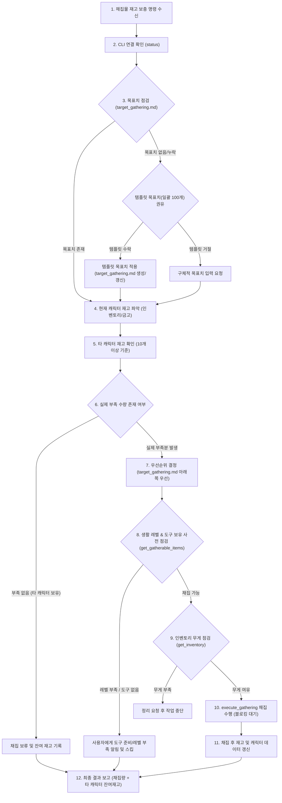

# 제2절: 채집물 재고 보충 작업 흐름 (Gathering Stock Replenishment Workflow)

* **갱신 일시**: 2026년 10월 5일

사용자가 `"재고 보충해줘"`, `"채집물 보충해줘"`, `"부족한 재료 채집해줘"`, `"나무 진액 목표치까지 모아줘"` 등의 명령을 내렸을 때 수행합니다. 세부 설정값 및 규칙은 [`references/constants.md`](../constants.md)를 준수합니다.

---

## 1. 워크플로우 다이어그램

---

## 2. 세부 실행 절차

0. **관리 대상 한정**:
   * 재고 관리 대상은 채집(Gathering)을 통해 획득할 수 있는 아이템으로 한정합니다.
1. **작업 시작 및 연결 확인**:
   * `MabinogiMobile_CLI status`로 인게임 연결을 확인합니다.
2. **목표치 점검**:
   * `data/target_gathering.md`를 읽어 관리 대상 채집 아이템의 목표 수량을 확인합니다.
   * `target_gathering.md`가 없거나 특정 아이템의 목표치가 누락된 경우:
     * 사용자에게 템플릿([`references/templates/target_gathering.md`](../templates/target_gathering.md))에 정의된 기본 목표치(`DEFAULT_TARGET_STOCK_QUANTITY`=100개)를 사용할 것을 권유합니다.
     * 사용자가 템플릿을 그대로 사용하겠다고 동의하면 템플릿의 목표치를 적용(`data/target_gathering.md` 생성 또는 갱신)합니다.
     * 사용자가 해당 목표치를 사용하지 않는다고 하면 구체적인 목표 수량을 직접 입력해 줄 것을 요구합니다.
3. **기준 캐릭터 지정 및 재고 파악**:
   * 재고 판단의 기준은 **'현재 접속한 캐릭터'**입니다.
   * 현재 캐릭터의 인벤토리(`_inventory.csv`) 및 개인 금고(`_bank.csv`), 공용 금고(`_bank_all.csv`)를 합산하여 현재 수량을 파악합니다.
4. **타 캐릭터 재고 확인**:
   * 현재 캐릭터의 재고가 목표치에 미달하는 경우, `data/characters/`에 저장된 다른 캐릭터들의 CSV 데이터를 조회하여 해당 아이템을 보유하고 있는지 확인합니다.
5. **채집 보류 판단 (`OTHER_CHAR_STOCK_THRESHOLD`=10개 기준)**:
   * 다른 캐릭터에 재고가 **10개 이상** 존재하는 경우 해당 아이템의 채집을 보류합니다.
   * **(예외 규칙)**: 다른 캐릭터가 가진 수량이 **10개 미만**인 경우는 실질적인 재고로 보지 않고 무시하여 채집 대상에 포함합니다.
6. **우선순위 배정 (`TARGET_PRIORITY_RULE`)**:
   * `data/target_gathering.md` 목록에서 **아래쪽에 위치한 항목일수록 높은 우선순위**를 가집니다.
   * 여러 아이템이 부족할 경우, 목록의 아래쪽 아이템부터 순서대로 채집 계획을 수립합니다.
7. **채집 도구 및 생활 스킬 레벨 사전 점검 (`get_gatherable_items`)**:
   * 채집 대상 아이템에 대해 `get_gatherable_items`를 호출하여, 현재 캐릭터의 생활 스킬 레벨이 충족되는지 및 필요한 채집 도구를 보유/장착하고 있는지 사전에 점검합니다.
   * 레벨이 부족하거나 도구가 없는 경우, 사용자에게 해당 사실을 알리고 다음 우선순위 아이템으로 넘어가거나 작업을 보류합니다.
8. **무게 관리**:
   * 채집 시작 전 `get_inventory`로 인벤토리 잔여 무게를 확인합니다.
   * 무게가 부족하여 채집물을 담을 수 없다면 작업을 즉시 멈추고 사용자에게 인벤토리 정리를 요청합니다.
9. **채집 수행 (`execute_gathering`)**:
   * 부족한 수량만큼 채집을 실행합니다.
   * *(한글 인자 전달 시 UTF-8 Base64 규칙 필수 준수)*
   * 채집이 끝날 때까지 프로세스를 대기(Blocking)합니다.
10. **결과 보고 및 데이터 최신화**:
    * 채집이 완료되면 새로 획득한 수량과 다른 캐릭터에 보관된 잔여 재고 현황을 사용자에게 명확히 보고합니다.
    * 채집 후 변동된 인벤토리 정보를 `data/characters/(서버)_(캐릭터)_inventory.csv` 및 `data/characters/(서버)_(캐릭터).md`에 즉시 반영하여 최신 상태를 유지합니다.
